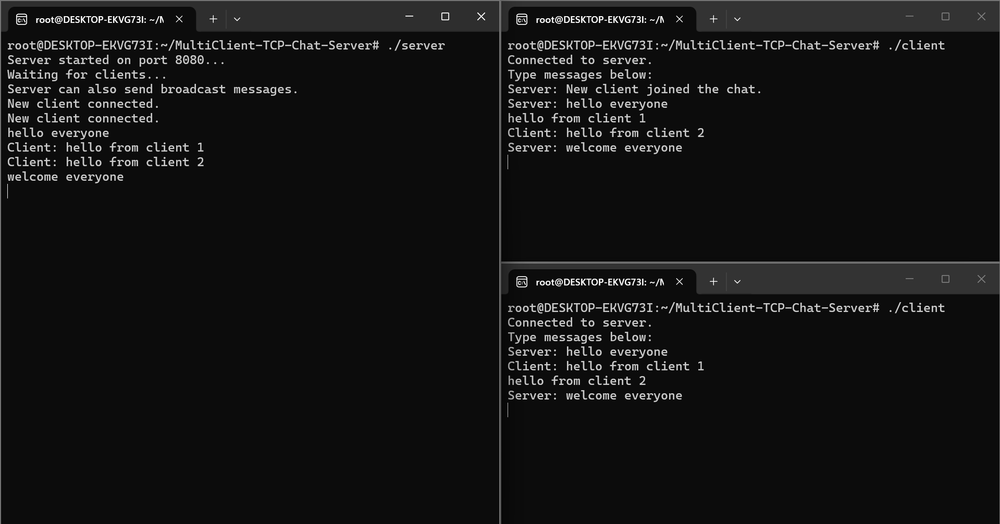

# Multi-Client TCP Chat Server with Server Broadcast using C++

## Overview

This project is a terminal-based multi-client chat application built using C++ socket programming. It uses TCP/IP communication to allow multiple clients to connect to a server and exchange messages in real time.

The server works as a central communication hub. Clients can send messages to the server, and the server broadcasts those messages to other connected clients. The server also supports admin/server-side broadcast messages to all connected clients.

## Features

- Multi-client chat support
- TCP/IP based reliable communication
- Client-to-client message exchange through server
- Server-side broadcast/admin messages
- Multithreaded client handling
- Client connection and disconnection handling
- Terminal-based testing using Ubuntu WSL

## Technologies Used

- C++
- TCP/IP
- Socket Programming
- Multithreading
- Ubuntu WSL
- Linux Terminal

## Project Structure

```text
MultiClient-TCP-Chat-Server/
├── server.cpp
├── client.cpp
├── README.md
└── screenshots/
    └── chat_output.png
```

## How to Compile

Open terminal inside the project folder and run:

```bash
g++ server.cpp -o server -pthread
g++ client.cpp -o client -pthread
```

## How to Run

### Terminal 1: Start Server

```bash
./server
```

### Terminal 2: Start Client 1

```bash
./client
```

### Terminal 3: Start Client 2

```bash
./client
```

## Working

1. The server starts on port 8080.
2. Multiple clients connect to the server.
3. Each connected client can send messages.
4. The server receives client messages and broadcasts them to other connected clients.
5. The server can also send broadcast/admin messages to all connected clients.
6. Clients can disconnect by typing `exit`.

## Sample Server Output

```text
Server started on port 8080...
Waiting for clients...
Server can also send broadcast messages.
New client connected.
New client connected.
Client: Hello from Client 1
Client: Hello from Client 2
```

## Sample Client Output

```text
Connected to server.
Type messages below:
Server: hello everyone
Client: hello from Client 1
Client: hello from Client 2
Server: welcome everyone
```

## Screenshots

### Server and Client Communication



## Resume Description

**Multi-Client TCP Chat Server with Server Broadcast using C++**

- Developed a TCP-based multi-client chat server using C++ socket programming for reliable message exchange.
- Implemented multithreading to handle multiple clients concurrently.
- Added server-side broadcast functionality to send admin messages to all connected clients.
- Designed client connection handling, message broadcasting, and graceful disconnection support using TCP/IP sockets.

## Future Improvements

- Add usernames for each client
- Add private messaging
- Add chat history logging
- Add encryption for secure communication
- Improve server shutdown handling

## Conclusion

This project demonstrates the use of TCP/IP socket programming and multithreading in C++ to build a real-time multi-client communication system. It is useful for understanding client-server architecture, message broadcasting, and network-based application development.
